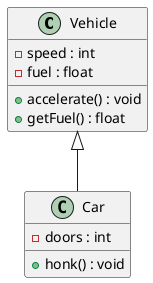

# uml-to-cpp-generator
A command-line tool that parses PlantUML class diagrams and generates C++ skeleton code -- class declarations, method stubs, include guards, and Doxygen comment blocks -- via Jinja2 templates, directly automating the UML-to-code translation workflow.

---

## Overview

Writing boilerplate C++ classes by hand is tedious. This tool takes a `.puml` class diagram as input, parses its structure, and automatically generates clean C++ header (`.h`) and source (`.cpp`) skeleton files — ready for you to fill in the logic.

```
Input:  Vehicle.puml  →  Parser  →  Generator  →  Vehicle.h + Vehicle.cpp
```

---

## Features

- Parse PlantUML class diagrams (`.puml` files) directly using regex
- Extract classes, attributes, methods, and relationships (inheritance, association)
- Generate `.h` and `.cpp` skeleton files via Jinja2 templates
- Simple CLI interface — point it at a `.puml` file and get code out
- Supports multiple classes in a single diagram

---

## Project Structure

```
uml-to-cpp/
├── samples/              # Sample .puml class diagram inputs
│   ├── vehicle.puml
│   ├── shapes.puml
│   └── library.puml
├── templates/            # Jinja2 templates for C++ output
│   ├── header.h.j2
│   └── source.cpp.j2
├── output/               # Generated C++ files (git-ignored)
├── parser.py             # Parses .puml files into Python data structures
├── generator.py          # Renders Jinja2 templates with parsed data
├── main.py               # CLI entry point
├── requirements.txt
└── .gitignore
```

---

## Requirements

- Python 3.8+
- macOS / Linux / Windows
- Virtual environment (recommended)

---

## Setup

```bash
# 1. Clone the repo
git clone https://github.com/YOUR_USERNAME/uml-to-cpp.git
cd uml-to-cpp

# 2. Create and activate virtual environment
python3 -m venv venv
source venv/bin/activate        # macOS/Linux
# venv\Scripts\activate         # Windows

# 3. Install dependencies
pip install -r requirements.txt
```

---

## Usage

```bash
python main.py --input samples/vehicle.puml --output output/
```

### Options

| Flag | Description | Default |
|---|---|---|
| `--input` | Path to the `.puml` input file | required |
| `--output` | Directory to write generated `.h` and `.cpp` files | `./output` |
| `--verbose` | Print parsed class info before generating | off |

### Example

Given this input (`samples/vehicle.puml`):



Running the tool:

```bash
python main.py --input samples/vehicle.puml --output output/
```

Produces:

**`output/Vehicle.h`**
```cpp
#pragma once

class Vehicle {
public:
    void accelerate();
    float getFuel();

private:
    int speed;
    float fuel;
};
```

**`output/Vehicle.cpp`**
```cpp
#include "Vehicle.h"

void Vehicle::accelerate() {
    // TODO: implement
}

float Vehicle::getFuel() {
    // TODO: implement
}
```

---

## Sample Diagrams

Three sample `.puml` diagrams are included in the `samples/` folder:

| File | Description |
|---|---|
| `vehicle.puml` | Vehicle and Car classes with inheritance |
| `shapes.puml` | Shape hierarchy — Circle, Rectangle, Triangle |
| `library.puml` | Library system — Book, Member, Loan classes |

---

## Dependencies

| Package | Purpose |
|---|---|
| `jinja2` | Template engine for rendering C++ files |
| `lxml` | XML parsing (for XMI export support) |
| `argparse` | CLI argument handling (stdlib) |
| `re` | Regex-based `.puml` parsing (stdlib) |

---

## How It Works

1. **Parse** — `parser.py` reads the `.puml` file using regex to extract class names, attributes (with types and visibility), methods (with return types and parameters), and relationships.

2. **Model** — The parsed data is stored in plain Python dictionaries/dataclasses representing each class.

3. **Generate** — `generator.py` feeds the model into Jinja2 templates (`header.h.j2` and `source.cpp.j2`) to render the final `.h` and `.cpp` files.

---

## Roadmap

- [ ] Support for abstract classes and interfaces
- [ ] Handle method parameters in signatures
- [ ] XMI/XML input support (PlantUML export format)
- [ ] Namespace / package support
- [ ] Unit tests with `pytest`

---

## License

MIT
